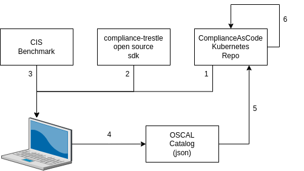

# kube-oscal-catalog
Kube OSCAL catalog

### overview

This repo comprises the [CIS Kubernetes Benchmark v1.7.0](https://workbench.cisecurity.org/files/4381) as an [OSCAL catalog](https://pages.nist.gov/OSCAL/concepts/layer/control/catalog/).

This repo is managed using open source project compliance-[trestle](https://github.com/IBM/compliance-trestle).
The initial catalog in OSCAL `json` format was created using the `trestle task ocp4-cis-profile-to-oscal-catalog` command.
Transformations between `markdown` documents and the corresponding OSCAL catalog.json are managed by the trestle automation scripts,
which employ trestle core commands.

The [catalog](catalogs/kube/catalog.json).

Example [markdown](md_catalogs/kube/CIS-1/CIS-1.1/CIS-1.1.1.md).

### agile authoring

The trestle Agile Authoring process facilitates management of the OSCAL json via the GIT managed lifecycle of markdown documents.
The process employs [GIT](https://docs.github.com/en/repositories/working-with-files/managing-files/editing-files) with trestle automation scripts as follows:
1. check-out a markdown document, representing one part of the OSCAL catalog
2. modify the markdown
3. check-in the markdown document, and create a pull request for review
4. once reviewed and approved, the markdown is employed to render a revised OSCAL catalog via the automation scripts in the repo

### initial OSCAL catalog.json and markdown (one time setup)

Before agile authoring can occur, steps employed to create the initial OSCAL catalog and markdown in this repo: 

1. [Clone](https://docs.github.com/en/get-started/using-git/getting-changes-from-a-remote-repository) the [kubernetes catalog](https://github.com/ComplianceAsCode/kube-oscal-catalog) repo
2. [Install compliance-trestle](https://ibm.github.io/compliance-trestle/python_trestle_setup/) into a virtual environment
3. Download `CIS_Kubernetes_Benchmark_v1.7.0.xlsx` into kubernetes catalog `data` folder: visit [cisecurity.org](https://www.cisecurity.org/benchmark/kubernetes)
4. Run: `trestle task cis-xlsx-to-oscal-catalog -c data/cis-xlsx-ocp-to-oscal-catalog.config`
5. Push the `catalog.json` into the repo
6. The trestle automation creates the markdown

### initial repo setup and population (one time setup)

Before initial OSCAL catalog.json and markdown are created, steps employed to setup the repo:

1. [Create](https://docs.github.com/en/get-started/quickstart/create-a-repo) a repo
2. Configure the repo by including a `GIT_TOKEN` (see `repo customization` below) and setting up [teams and people](https://docs.github.com/en/repositories/managing-your-repositorys-settings-and-features/managing-repository-settings/managing-teams-and-people-with-access-to-your-repository) if desired
3. Download a template repo (for example this one)
4. Update the automation scripts (see `automation scripts customizations` below)
5. Popluate the repo 

-----

##### repo customization

Settings -> Secrets and variables -> Actions

- Add Repository secret `GIT_TOKEN` with your personal token created [here](https://github.com/settings/tokens)
- Be sure token has `workflow` checked

-----

##### automation scripts customizations

These scripts were customized in scripts automation as follows.

##### check_and_update_all.sh

- `trestle task ocp4-cis-profile-to-oscal-catalog -c data/trestle task cis-xlsx-to-oscal-catalog data/cis-xlsx-ocp-to-oscal-catalog.config`

##### check_and_update_all.sh

- `remote=https://$GIT_TOKEN@github.com/ComplianceAsCode/kube-oscal-catalog`

##### update_profile.sh

- `export COMMIT_BODY="Sync catalogs with kube-oscal-catalog repo"`
- `cd kube-oscal-profile`
- `remote=https://$GIT_TOKEN@github.com/ComplianceAsCode/kube-oscal-profile`

